# Mindful News — Informe del Obligatorio

**Repositorio:** [arihsieh/mlprod-obligatorio](https://github.com/arihsieh/mlprod-obligatorio)

---

## Índice

1. [Qué construimos](#1-qué-construimos)
2. [Datos: scraping y etiquetado](#2-datos-scraping-y-etiquetado)
3. [Por qué dos modelos separados](#3-por-qué-dos-modelos-separados)
4. [Por qué mmBERT-small](#4-por-qué-mmbert-small)
5. [Proceso de entrenamiento](#5-proceso-de-entrenamiento)
6. [Métricas utilizadas](#6-métricas-utilizadas)
7. [Resultados](#7-resultados)
8. [Sistema en producción](#8-sistema-en-producción)

---

## 1. Qué construimos

**Mindful News** es un portal de noticias uruguayo que classifica titulares automáticamente en dos dimensiones:

- **Tema**: a cuál de 10 categorías pertenece la noticia (`politica`, `seguridad`, `economia`, `salud`, `deportes`, `cultura`, `tecnologia`, `medioambiente`, `internacional`, `sociedad`)
- **Carga emocional**: qué tan impactante/perturbadora es la noticia (`baja`, `media`, `alta`)

El usuario puede filtrar por tema, por carga y por medio, y ver solo lo que le interesa. La idea detrás de la carga es que si alguien quiere informarse sin llenarse de noticias pesadas, puede filtrar `baja` y ver solo lo que no le genera ansiedad.

Stack completo:

```
EC2 (t3.large) ─── MySQL
                ─── FastAPI (modelos + portal)  → puerto 8000
                ─── Poller (Playwright, 30 min)
```

---

## 2. Datos: scraping y etiquetado

### Fuentes

Scrapeamos 4 medios uruguayos: **El Observador**, **El País**, **La Diaria** y **Montevideo Portal**. Usamos Playwright para contenido dinámico y `requests`+`BeautifulSoup` para APIs y sitemaps.

### Dataset inicial

El dataset de entrenamiento es un export de ~12k titulares ya clasificados. Las etiquetas las generó GPT en batch, con prompts diseñados para las categorías del proyecto.

```
filas:  12.005
medios: 4
temas:  10
cargas: 3
rango:  1991-09-19 → 2026-06-05
```

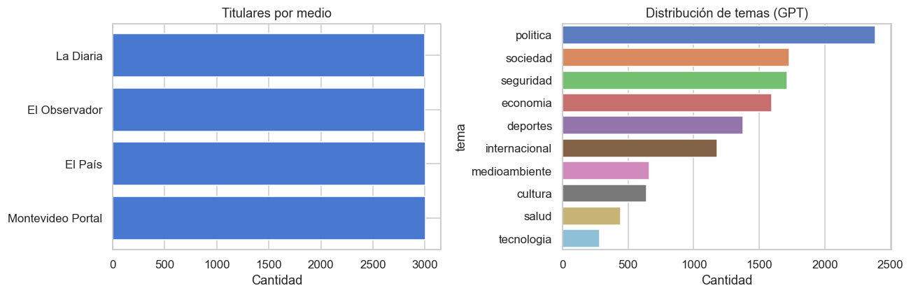

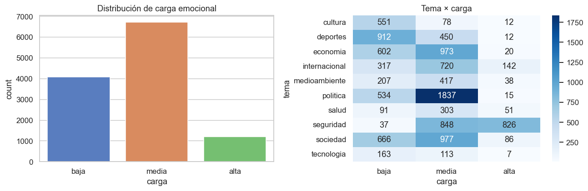

### Splits temporales

Para respetar la naturaleza temporal de los datos y evitar data leakage, los splits se hacen por fecha de publicación (no random):

| Split | Filas | Rango |
|-------|-------|-------|
| train | 8.403 | hasta 2026-05-13 |
| val   | 1.801 | 2026-05-13 → 2026-05-26 |
| test  | 1.801 | 2026-05-26 → 2026-06-05 |

Proporciones: 70/15/15. El test contiene los titulares más recientes, que el modelo nunca vio durante el entrenamiento.

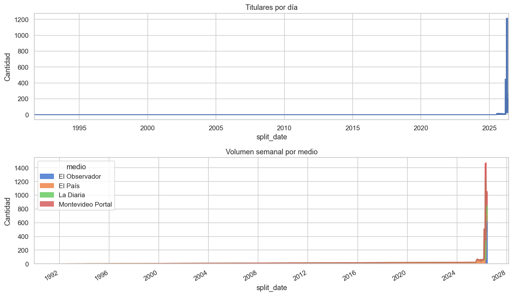

### Input al modelo

Después de explorar, encontramos que usar `seccion | titulo` como input mejora bastante la clasificación de temas. La sección del medio (ej: `Noticias, Policiales`, `deportes`, `economia`) ya da contexto que ayuda al modelo a desambiguar.

```
seccion | titulo
→ "Noticias, Policiales | Dos veces en dos semanas: balearon casa en Jardines del Hipódromo"
→ "deportes | Nacional y Peñarol ya conocen sus rivales"
```

Si el titular no tiene sección (pasa en ~0.02% de los casos), se usa solo el título. Esto se implementó en la fase 4 de tuning para temas (ver más abajo).

---

## 3. Por qué dos modelos separados

La primera pregunta fue si entrenar un solo modelo multitarea o dos modelos independientes.

Elegimos **dos modelos separados** porque entendemos que tema y carga emocional son conceptualizaciones muy distintas y no tienen overlap de conocimiento real:

- El **tema** depende del contenido factual del titular: qué pasó, sobre qué trata.
- La **carga** depende más del tono, las palabras usadas y la gravedad implícita, independientemente del tema. Una noticia de deportes puede tener carga alta ("murió el DT en el estadio") o baja ("Nacional entrenó hoy").

Si entrenás un modelo conjunto, tenés que o bien predecir ambas al mismo tiempo (y la loss te "promedia" dos señales muy distintas), o bien compartir representaciones que quizás no se benefician mutuamente. Con dos modelos separados cada uno optimiza para su tarea sin interferencia.

En la práctica también es más fácil reentrenar uno solo si necesitás mejorar algo puntual.

---

## 4. Por qué mmBERT-small

El modelo base es [`jhu-clsp/mmBERT-small`](https://huggingface.co/jhu-clsp/mmBERT-small).

Las opciones que evaluamos:

| Modelo | Parámetros | Multilingüe | Español |
|--------|-----------|-------------|---------|
| `mmBERT-small` | ~66M | ✓ (104 idiomas) | ✓ bueno |
| `distilbert-base-multilingual-cased` | ~135M | ✓ | ✓ ok |
| `dccuchile/bert-base-spanish-wwm-cased` | ~110M | ✗ solo español | ✓✓ mejor |
| `roberta-base` (en inglés) | ~125M | ✗ | ✗ |

Elegimos mmBERT-small por:

1. **Tamaño**: con ~66M parámetros es el más liviano. Podemos deployar dos instancias (una por tarea) en un t3.large con 8GB RAM sin problema.
2. **Multilingüe pero eficiente**: para español ya es suficientemente bueno. El BERT español mono-lingual sería mejor en métricas puras, pero pesa el doble y necesitaríamos el doble de RAM.
3. **Throughput en inferencia**: con un modelo pequeño el batch de clasificación del poller (cada 30 min) tarda segundos, no minutos.
4. **`max_length=128`** es suficiente para titulares cortos, así que no hay penalidad por truncar.

El tradeoff es que perdemos algo de F1 frente al BERT español grande, pero para una app de producción liviana la relación costo/beneficio es mejor.

---

## 5. Proceso de entrenamiento

### Framework

- `transformers` de HuggingFace + `Trainer`
- `optuna` para HPO (búsqueda de hiperparámetros)
- `wandb` para tracking de todos los runs
- GPU local (cuando disponible), sino CPU

### Hiperparámetros tuneados

En cada fase, Optuna busca sobre:
- `learning_rate`: [1e-5, 5e-5] (log scale)
- `batch_size`: [16, 24, 32, 48, 64] (según la fase)
- `num_epochs`: [2, 8]
- `warmup_ratio`: [0.05, 0.2]
- `weight_decay`: [0.0, 0.1]

La métrica objetivo es siempre **F1 macro en val**. `EarlyStoppingCallback` con patience=2 para cortar runs que se empiecen a pasar.

### Fases de tuning

Entrenamos en múltiples fases iterativas. Cada fase toma como "anchor" los mejores parámetros de la fase anterior y refina el search space:

**Temas:**

| Fase | Trials | Search space | Mejor val F1 | Mejor test F1 |
|------|--------|--------------|--------------|---------------|
| 1 | 15 | amplio (exploración) | 0.780 | 0.742 |
| 2 | 30 | narrowed (LR 2.5e-5→5e-5) | 0.770 | 0.745 |
| 3 | 15 | más estrecho aún | 0.774 | 0.732 |
| 4 | 30 | input seccion+titulo | 0.793 | **0.757** |

**Carga:**

| Fase | Trials | Search space | Mejor val F1 | Mejor test F1 |
|------|--------|--------------|--------------|---------------|
| 1 | 15 | amplio | 0.812 | 0.780 |
| 2 | 30 | narrowed | 0.820 | 0.774 |
| 3 | 15 | más estrecho | 0.813 | **0.783** |

En total: **~120 trials** repartidos entre ambas tareas y fases. Cada trial es un training completo con sus hiperparámetros sampliados, todos trackeados en W&B.

El mejor modelo de cada fase se guarda como checkpoint y se evalúa en test. El modelo que va a producción es el que tiene el mejor test F1, no el mejor val F1 (para evitar elegir el más overfit a val).

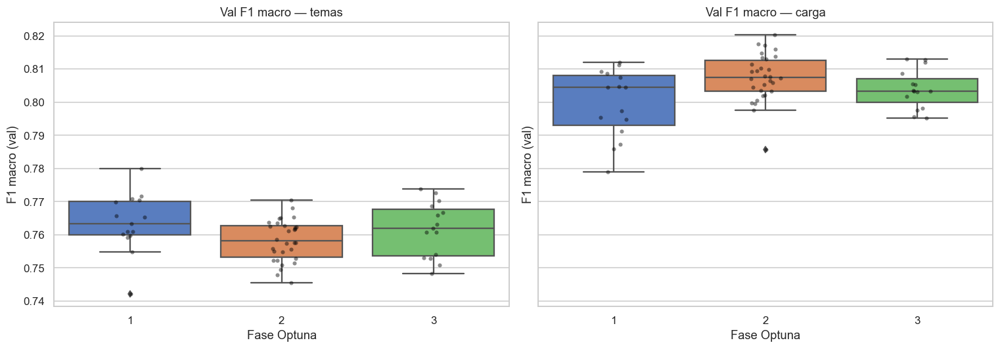

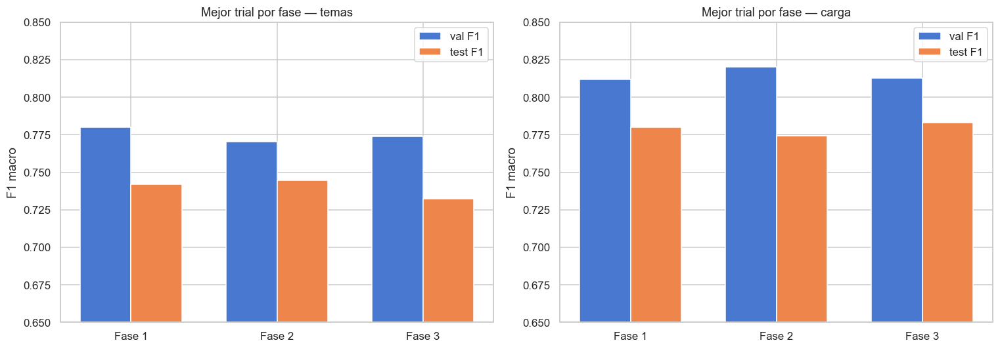

### La fase 4 de temas: sección + título

La decisión más importante post-baseline fue cambiar el input para temas. En las primeras 3 fases, el modelo solo recibía el título. En la fase 4, pasamos a `{seccion} | {titulo}`.

El resultado:

```
Fase 1 (solo título):      444/1801 errores | acc=0.753 | F1=0.742
Fase 4 (sección+título):   409/1801 errores | acc=0.773 | F1=0.757

Predicciones distintas: 311
Corregidos: 137  (+20 pp neto en este subset)
Empeorados: 108
```

Ganancia neta de +0.015 en F1 macro. No es enorme pero es consistente. Los más beneficiados fueron `politica` (+0.060), `economia` (+0.035) y `sociedad` (+0.025) — temas que la sección del medio desambigua bastante bien.

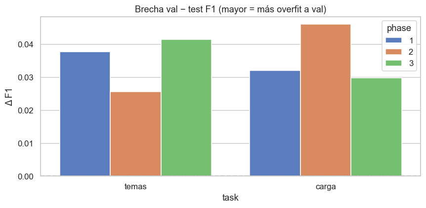

---

## 6. Métricas utilizadas

### F1 macro

La métrica principal. Promedio de F1 por clase, sin ponderar por tamaño de clase. La usamos como objetivo de Optuna y para comparar modelos.

Lo usamos en lugar de accuracy o F1 weighted porque las clases están desbalanceadas (deportes tiene 315 ejemplos en test, salud tiene 51). Con accuracy el modelo puede hacer bien solo en las clases grandes y verse bien. Con F1 macro, si falla en `salud` o `cultura`, eso baja la métrica igual que si falla en `politica`.

### Accuracy

Complementaria. La reportamos pero no la usamos para seleccionar modelos. Sirve como sanity check.

### F1 weighted

F1 promediado ponderando por support de cada clase. Más representativo del performance "en la práctica" (las clases grandes importan más), pero puede ocultar problemas en clases pequeñas.

### F1 por clase (classification report)

Siempre miramos el reporte completo para entender dónde falla. Esto es lo más útil para debugging:

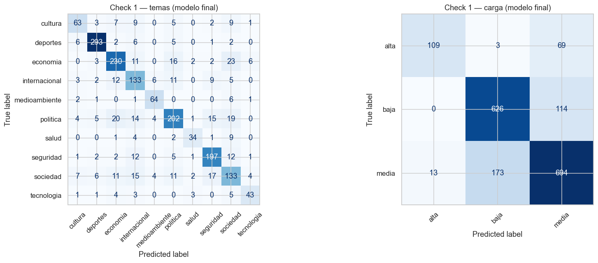

**Temas — F1 por clase (modelo final, fase 4):**

| Clase | F1 | Precision | Recall | Support |
|-------|-----|-----------|--------|---------|
| deportes | 0.929 | 0.935 | 0.917 | 315 |
| medioambiente | 0.837 | 0.791 | 0.907 | 75 |
| seguridad | 0.826 | 0.821 | 0.824 | 233 |
| economia | 0.750 | 0.733 | 0.768 | 293 |
| tecnologia | 0.741 | 0.811 | 0.717 | 60 |
| cultura | 0.677 | 0.654 | 0.687 | 99 |
| internacional | 0.684 | 0.708 | 0.669 | 181 |
| salud | 0.723 | 0.762 | 0.627 | 51 |
| politica | 0.747 | 0.770 | 0.662 | 284 |
| sociedad | 0.614 | 0.538 | 0.643 | 210 |

`deportes` y `medioambiente` son los más fáciles. `sociedad` es el más difícil — tiene mucho overlap con `politica`, `economia` y `cultura`. Es esperable: "sociedad" como categoría es bastante ambigua en sí misma.

**Carga — F1 por clase (modelo final, fase 3):**

| Clase | F1 | Precision | Recall | Support |
|-------|-----|-----------|--------|---------|
| baja | 0.818 | 0.809 | 0.828 | 740 |
| media | 0.804 | 0.790 | 0.819 | 880 |
| alta | 0.727 | 0.869 | 0.624 | 181 |

`alta` tiene la mejor precisión (0.869) pero el recall más bajo (0.624) — el modelo es conservador, solo predice "alta" cuando está bastante seguro, pero se le escapan bastantes casos reales de alta carga.

### Brecha val-test (overfitting proxy)

También miramos el gap entre val F1 y test F1. Un gap grande indica que el modelo overfitta a la distribución de val. Las fases mejor calibradas tienen gaps de ~0.025-0.035.

### Confianza del modelo

En el sanity check miramos la distribución de probabilidad máxima (softmax) para predicciones correctas vs incorrectas. El modelo comete la mayoría de sus errores cuando la confianza es baja (< 0.6), lo cual es una señal sana — los errores de alta confianza serían más preocupantes.

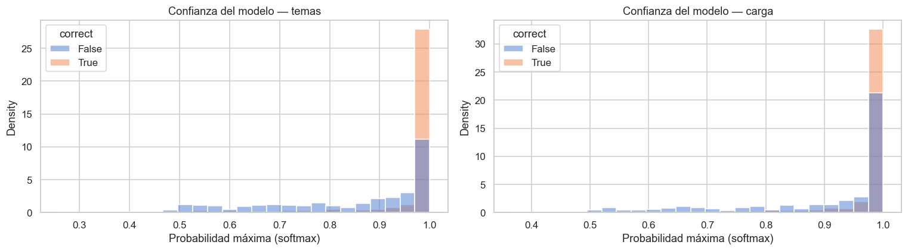

---

## 7. Resultados

### Modelos en producción

| Modelo | Accuracy test | F1 macro test | Fases | Trials totales |
|--------|--------------|---------------|-------|---------------|
| temas-phase4 | **77.3%** | **0.757** | 4 | ~75 |
| carga-phase3 | **79.3%** | **0.783** | 3 | ~45 |

### Matrices de confusión (modelos finales)

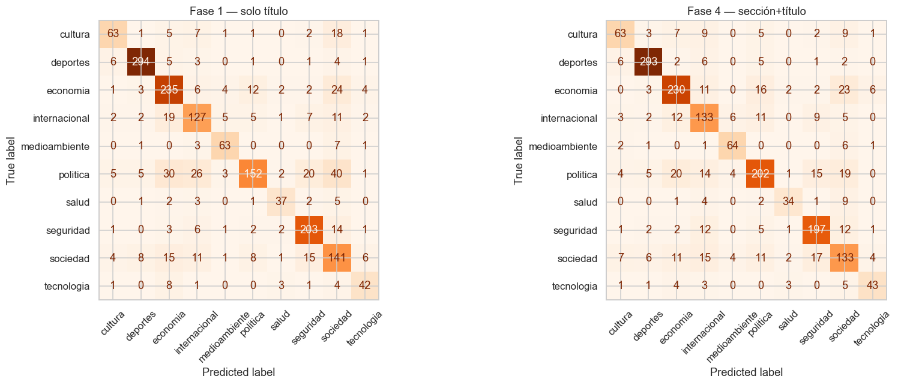

Los errores más frecuentes en temas son los esperables: `politica↔economia`, `politica↔sociedad`, `sociedad↔seguridad`. Categorías que comparten vocabulario en el contexto uruguayo.

### Impacto de sección + título

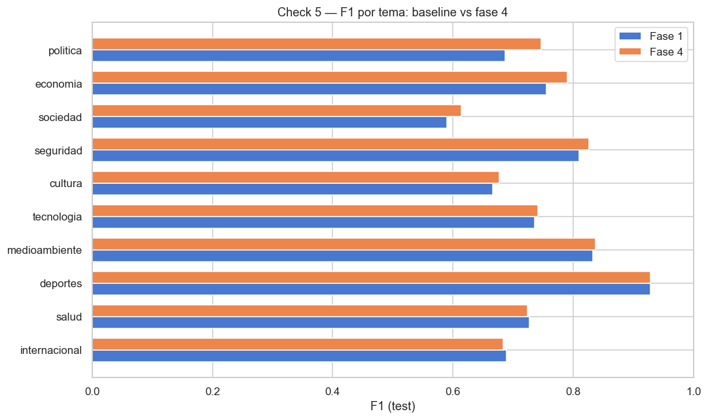

La mejora de incluir la sección es desigual. Donde más ayuda es en `politica` (+0.060) porque muchos medios tienen secciones explícitas como "Noticias, Política". Donde no cambia mucho es en `deportes` (ya era evidente por el título) o `internacional` (la sección no siempre ayuda a distinguir).

### Tasa de error por clase

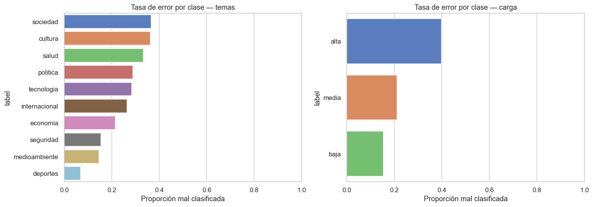

---

## 8. Sistema en producción

### Arquitectura

```
Internet
    │
    ▼
EC2 t3.large (AWS)
    ├── mysql:3306          (Docker, volumen persistente)
    ├── api:8000            (FastAPI)
    │     ├── GET  /portal  → sirve index.html
    │     ├── GET  /api/headlines  → headlines filtrados + paginados
    │     └── POST /predict/batch → inferencia con los dos modelos
    └── poller              (Playwright + requests, cada 30 min)
          ├── scrape_latest (El Observador, El País, La Diaria, Montevideo Portal)
          ├── gap_fill      (detecta huecos y los rellena)
          ├── enrich        (busca thumbnail y fecha en páginas de artículos)
          └── classify      (llama a /predict/batch para todo lo pendiente)
```

### Pipeline del poller

Cada 30 minutos:

1. **Gap fill**: detecta artículos recientes que se perdieron (por IDs numéricos en El Observador, sitemaps en La Diaria, secciones en El País) y los inserta.
2. **Scrape latest**: las últimas ~50 noticias por fuente usando la listing page de cada medio.
3. **Enrich**: para todos los titulares sin `thumbnail_url` o `fecha`, visita la página del artículo y extrae `og:image` y la fecha de publicación.
4. **Classify**: corre los dos modelos sobre todo lo que no tiene `tema` y `carga` asignados.

### Deduplicación

Deduplicamos por `(medio, external_id)` — no por URL, porque el mismo artículo puede aparecer con slugs distintos. El Observador, por ejemplo, usa IDs numéricos en la URL.

### API

```python
GET /api/headlines?t=politica&c=baja&m=El+Observador&page=2
```

Parámetros: `t` (tema), `c` (carga), `m` (medio), `page`. Devuelve 30 resultados por página, ordenados por `GREATEST(COALESCE(fecha, scraped_at), scraped_at) DESC`.

### Deploy

EC2 `t3.large` (2 vCPU, 8 GB RAM, volumen 40 GB). Docker Compose con tres servicios: `mysql`, `api`, `poller`. Los modelos se empaquetan en un `.tar.gz` y se copian al servidor antes del `docker compose up --build`.

El portal está en `http://<IP>:8000/portal`.

### Frontend

HTML/CSS/JS puro, sin frameworks. Filtros por tema, carga y medio. En desktop la barra de filtros es sticky; en mobile/tablet es un drawer. Paginación con "Cargar más". Las fechas se muestran en `America/Montevideo` (UTC-3).
